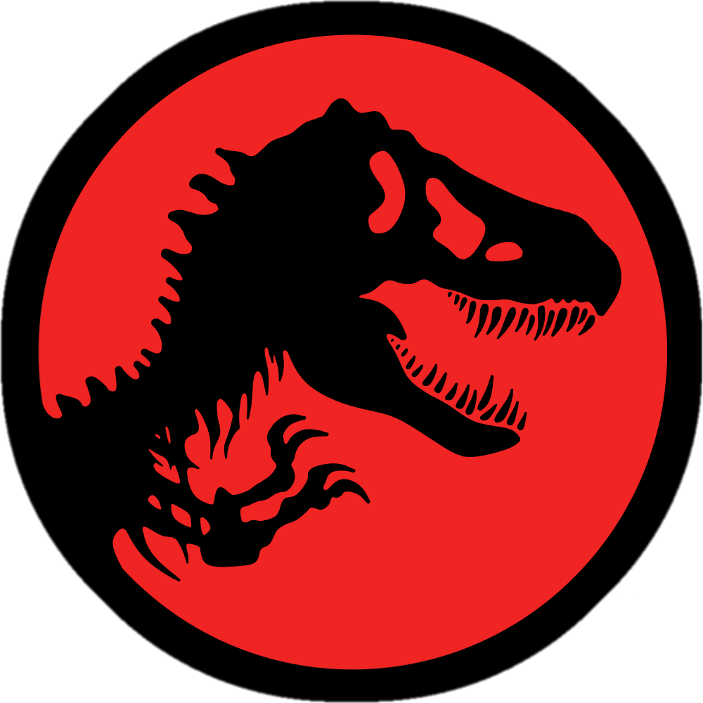

<a name="readme-top">

<br/>

<br />
<div align="center">
  <a href="https://github.com/johann122004/">
  <!-- TODO: If you want to add logo or banner you can add it here -->
    
  </a>
<!-- TODO: Change Title to the name of the title of your Project -->
  <h3 align="center">Headers and Footers Display Website</h3>
</div>
<!-- TODO: Make a short description -->
<div align="center">
  This Seatwork Website is designed to demonstrate the capabilities of HTML and CSS in designing different variations of Headers and Footers
</div>

<br />

<!-- TODO: Change the zyx-0314 into your github username  -->
<!-- TODO: Change the WD-Template-Project into the same name of your folder -->


---

<br />
<br />

<!-- TODO: If you want to add more layers for your readme -->
<details>
  <summary>Table of Contents</summary>
  <ol>
    <li>
      <a href="#overview">Overview</a>
      <ol>
        <li>
          <a href="#key-components">Key Components</a>
        </li>
        <li>
          <a href="#technology">Technology</a>
        </li>
      </ol>
    </li>
    <li>
      <a href="#rules,-practices-and-principles">Rules, Practices and Principles</a>
    </li>
    <li>
      <a href="#guide">Guide</a>
    </li>
    <li>
      <a href="#answers">Answers</a>
    </li>
    <li>
      <a href="#resources">Resources</a>
    </li>
  </ol>
</details>

---

## Overview

<!-- TODO: To be changed -->
<!-- The following are just sample -->
Description of the project in details.

Guiding Question:
- What is the project
- Whats the purpose
- What are key components
- What technology used and how it is used

### Key Components
<!-- TODO: List of Key Components -->
<!-- The following are just sample -->
- MultiPage Website
- Animated features

### Technology
<!-- TODO: List of Technology Used -->


## Rules, Practices and Principles
1. Always use `WD-` in the front of the Title of the Project for the Subject followed by your custom naming.
2. Do not rename any .html files; always use `index.html` as the filename.
3. Place Files in their respective folders.
4. All file naming are in camel case.
   - Camel case is naming format where there is no white space in separation of each words, the first word is in all lower case while the succeding words first letter are in upper followed by lower cased letters.
   - ex.: buttonAnimatedStyle.css
    - For this Seatwork however, lower-kebab-case will be used instead. lower-kebab-case is a naming format where spaces are replaced with hyphens, and words are all lower cased.
    - ex.: funny-man.jpg
5. Use only `External CSS`.
6. Renaming of Pages folder names are a must, and relates to what it is doing or data it holding.
7. File Structure to follow below.

```
WD-ProjectName
└─ assets
|   └─ css
|   |   └─ style.css
|   └─ img
|   |   └─ fileWith.jpeg/.jpg/.webp/.png
|   └─ js
|       └─ script.js
└─ pages
|  └─ pageName
|     └─ assets
|     |  └─ css
|     |  |  └─ style.css
|     |  └─ img
|     |  |  └─ fileWith.jpeg/.jpg/.webp/.png
|     |  └─ js
|     |     └─ script.js
|     └─ index.html
└─ index.html
└─ readme.md
```

## Guide
#### How to use this website?
1. In the website, you will be introduced to two buttons, each will take you to a new webpage, the header button will take you to the header webpage, and the footer button will take you to the footer webpage.
2. In each webpage, you will be shown the static and animated versions of Headers and Footers.
3. There are 5 header designs each for static and animated versions, which are interactable.
4. If you are feeling that you want to go back to the homepage, each webpage has a return to homepage button.

## Answers
1. The Project is an HTML Website with External CSS Styling that features static and Animated Headers and Footers.
2. The Purpose of this project is to serve as Seatwork #003 for Web Design with Client-Side Scripting.
3. The Key components are that the Project is a Multi-Page Website, and that it has Animated Features. For the Multipage Website part, the project features a landing page and 2 pages, each focusing on the static and animated examples of Headers and Footers. For the Animated Features part, the website has Headers and Footers that are animated and can be interacted with.
4. The Technology that is used are HTML and CSS. HTML is used to create the Website, while CSS is used to style and design the website, including adding animations to it.

## Resources

<!-- TODO: Add References -->
| Title | Purpose | Link |
| CSS rotate Property | For Rotation Manipulation for Animated Headers and Footers. | https://www.w3schools.com/cssref/css_pr_rotate.php |
| CSS Transitions | For Smooth Transition to different colors and symbols. | https://www.w3schools.com/css/css3_transitions.asp |
| CSS :hover Selector | Vital component for Animations. | https://www.w3schools.com/cssref/sel_hover.php |